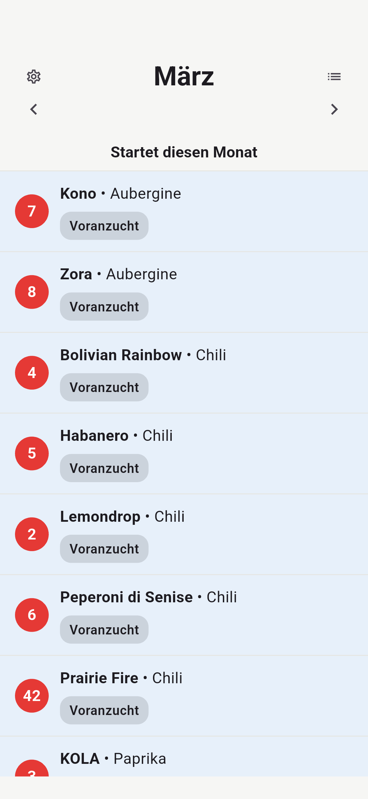
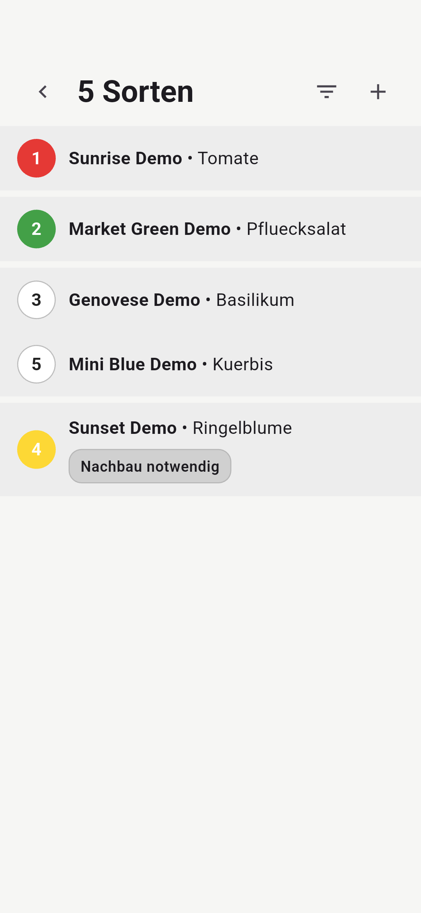
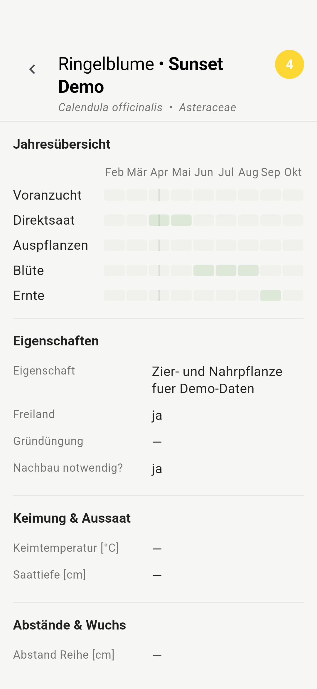

# Saatenschlüssel

*A month-based seed planning app for gardeners.*


Saatenschlüssel is a mobile app for managing personal seed collections.

Instead of acting as a static seed database, the app focuses on **monthly gardening actions**.  
It shows which varieties are relevant in a given month for sowing, pre-cultivation, or seed saving.

The goal is simple:

> Open the app, select the month, and immediately see what you can sow.

<p align="center">
  
</p>

---

## Features

- Month-based sowing overview
- Visual tube identification (color + number)
- Fast variety search
- Detailed cultivation calendar
- Offline-first seed data

---

## Overview

Saatenschlüssel helps manage a personal seed collection stored in color-coded tubes and connects this physical organization with digital planning.

The app emphasizes:

- **Month-based planning** instead of static lists
- **Visual identification** via tube color and number
- **Action-oriented relevance** (sow, pre-cultivate, seed saving)
- **Simple mobile access** in the garden

The aim is to reduce friction between planning and doing.

Instead of browsing a database, the app answers one question:

**What is relevant this month?**

---

## Naming & Language

This repository is named **samenbank-app**, while the application itself is called **Saatenschlüssel**.

The repository name reflects the original internal project name (“Samenbank”), referring to the structured storage of a seed collection.

During development, the user-facing name **Saatenschlüssel** was chosen because it better captures the idea of the app:  
helping gardeners quickly identify which seeds are relevant in a given month.

The user interface of the app is currently **German**, since the project started as a personal gardening tool.


---

## Screenshots

<p align="center">
  
  
  
</p>

### Month view

Shows all varieties that are relevant in the selected month, grouped by activity such as sowing or pre-cultivation.

### Variety list

Searchable overview of all stored varieties with tube color and number as the primary identifier.

### Variety detail

Detailed information about a variety including cultivation calendar, plant properties, and growing information.

---

## Key Concepts

### Tube-based identification

Each seed variety is stored in a physical tube with:

- a **color** indicating the plant category
- a **number** identifying the individual tube

Example:

```text
Red tube #7 → Eggplant “Kono”
```

Tube colors represent plant groups:

| Color | Category |
|------|--------|
| 🔴 Red | Fruit vegetables |
| 🔵 Blue | Brassicas |
| 🟢 Green | Leaf vegetables / salads |
| ⚪ White | Legumes / miscellaneous |
| 🟡 Yellow | Flowers |

The app mirrors this system so that digital information and physical storage remain aligned.

### Month-based relevance

Instead of browsing a full database, the main interface answers a simple question:

> **What can I sow this month?**

A variety becomes visible when any of the following activities fall within the selected month:

- pre-cultivation
- direct sowing
- transplanting
- flowering
- harvest
- seed saving

---

## Project Philosophy

Many gardening apps focus on plant databases, reminders, or social features.

Saatenschlüssel follows a different idea:  
gardening decisions are primarily **seasonal timing problems**.

Instead of managing large plant databases, the app focuses on answering a single practical question:

**What can I sow this month?**

The interface is intentionally simple and optimized for quick use while planning or working in the garden.

---

## Technology

The app is built using:

- **Flutter** for the UI
- **Dart** for domain logic
- **JSON-based seed data model**

The architecture separates:

- UI
- domain models
- repository layer
- data format contracts

This keeps the system maintainable and allows the data model to evolve independently from the UI.

---

## Development

The project is developed primarily as a personal tool and learning project.

Nevertheless, the architecture follows clear separation principles:

- domain models
- repository layer
- UI layer
- structured data contracts

This keeps the system maintainable and makes experimentation with the data model easier.

---

## Running the app

Requirements:

- Flutter SDK
- Android device or emulator

Run:

```bash
flutter pub get
flutter run
```

---

## Releases

Published app downloads should be provided through GitHub Releases:

- [GitHub Releases](https://github.com/fUhlm/samenbank-app/releases)

GitHub Releases are the preferred download location because they provide versioned tags, release notes, and downloadable APK assets without storing binaries in the repository history.

---

## Android release APK

To build a signed Android release APK, use:

```bash
./build-release.sh
```

The script:

- prompts for signing passwords if needed
- builds the release APK

The output APK is created here:

```bash
build/app/outputs/flutter-apk/app-release.apk
```

You can override the app version used during the build:

```bash
./build-release.sh --build-name=1.0.1 --build-number=2
```

The signing configuration itself stays local and must not be committed:

- `android/key.properties`
- `.jks` / `.keystore` files

Recommended release flow:

1. Build the signed APK with `./build-release.sh`
2. Create a Git tag such as `v1.0.1`
3. Open [GitHub Releases](https://github.com/fUhlm/samenbank-app/releases)
4. Draft a new release from that tag
5. Upload `build/app/outputs/flutter-apk/app-release.apk` as a release asset

---

## Project Status

The project is currently under active development.

Implemented so far:

- month-based overview
- variety list and search
- variety detail view
- cultivation calendar visualization

Planned features:

- improved filtering
- seed inventory tracking
- data import/export
- optional synchronization support

---

## Purpose

Saatenschlüssel is a personal project developed to simplify garden planning and to explore structured domain-driven app development.

The focus is not on building a generic gardening platform, but on creating a tool that supports **real gardening workflows** in a simple and reliable way.
